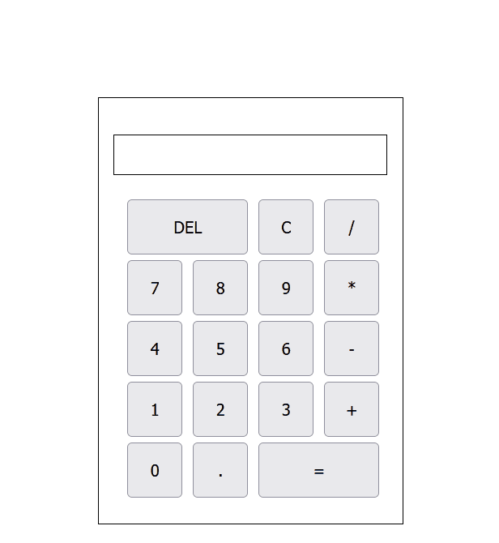

# calculator
A simple calculator using HTML5, CSS, and JavaScript.
# About
I used the table from HTML to create the calculator.This uses the buttons that a basic calculator has. There are add, subtract, multiply, divide, clear, and delete. If the user attempts to enter an equation with division by 0, a warning message will appear above the calculator and the equation will not be evaluated. 
# Demo

